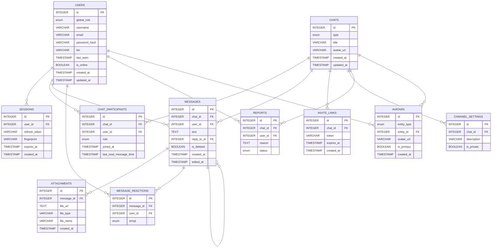

```mermaid
erDiagram
    USERS {
        INTEGER id PK
        enum global_role
        VARCHAR username
        VARCHAR email
        VARCHAR password_hash
        VARCHAR bio
        TIMESTAMP last_seen
        BOOLEAN is_online
        TIMESTAMP created_at
        TIMESTAMP updated_at
    }

    SESSIONS {
        INTEGER id PK
        INTEGER user_id FK
        VARCHAR refresh_token
        VARCHAR fingerprint
        TIMESTAMP expires_at
        TIMESTAMP created_at
    }

    CHATS {
        INTEGER id PK
        enum type
        VARCHAR title
        VARCHAR avatar_url
        TIMESTAMP created_at
        TIMESTAMP updated_at
    }

    CHAT_PARTICIPANTS {
        INTEGER id PK
        INTEGER chat_id FK
        INTEGER user_id FK
        enum role
        TIMESTAMP joined_at
        TIMESTAMP last_read_message_time
    }

    MESSAGES {
        INTEGER id PK
        INTEGER chat_id FK
        INTEGER user_id FK
        TEXT text
        INTEGER reply_to_id FK
        BOOLEAN is_deleted
        TIMESTAMP created_at
        TIMESTAMP edited_at
    }

    ATTACHMENTS {
        INTEGER id PK
        INTEGER message_id FK
        TEXT file_url
        VARCHAR file_type
        VARCHAR file_name
        TIMESTAMP created_at
    }

    MESSAGE_REACTIONS {
        INTEGER id PK
        INTEGER message_id FK
        INTEGER user_id FK
        enum emoji
    }

    INVITE_LINKS {
        INTEGER id PK
        INTEGER chat_id FK
        VARCHAR token
        TIMESTAMP expires_at
        TIMESTAMP created_at
    }

    CHANNEL_SETTINGS {
        INTEGER id PK
        INTEGER chat_id FK
        VARCHAR description
        BOOLEAN is_private
    }

    REPORTS {
        INTEGER id PK
        INTEGER chat_id FK
        INTEGER user_id FK
        TEXT reason
        enum status
    }

    AVATARS {
        INTEGER id PK
        enum entity_type
        INTEGER entity_id FK
        VARCHAR avatar_url
        BOOLEAN is_primary
        TIMESTAMP created_at
    }

    USERS ||--o{ SESSIONS : ""
    USERS ||--o{ CHAT_PARTICIPANTS : ""
    USERS ||--o{ MESSAGES : ""
    USERS ||--o{ MESSAGE_REACTIONS : ""
    USERS ||--o{ REPORTS : ""

    CHATS ||--o{ CHAT_PARTICIPANTS : ""
    CHATS ||--o{ MESSAGES : ""
    CHATS ||--o{ INVITE_LINKS : ""
    CHATS ||--o{ CHANNEL_SETTINGS : ""
    CHATS ||--o{ REPORTS : ""

    MESSAGES ||--o{ ATTACHMENTS : ""
    MESSAGES ||--o{ MESSAGE_REACTIONS : ""
    MESSAGES ||--o{ MESSAGES : ""

    USERS ||--o{ AVATARS : ""
    CHATS ||--o{ AVATARS : ""
```
